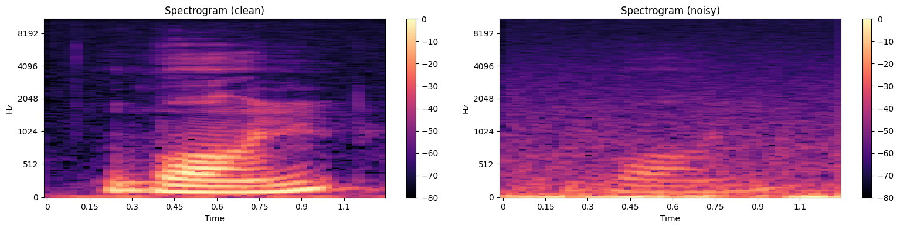

# Denoising Audio MNIST Dataset Using Autoencoders

## Abstract
In this project, we design and train a convolutional autoencoder to denoise audio recordings of spoken digits from the Audio MNIST dataset. Raw audio signals are transformed into Mel spectrograms to efficiently extract features. A U-Net architecture is used to reconstruct clean audio from noisy inputs. The model is evaluated using Mean Squared Error (MSE) and visually through waveform and spectrogram comparisons. Generalization performance across unseen speakers and digits is also analyzed.

---

## 1. Introduction
Audio denoising is critical for applications like speech recognition, hearing aids, and audio enhancement. The goal is to remove noise from recordings while preserving the spoken content. Due to the time-frequency complexity of audio, spectrogram representations are used, allowing convolutional neural networks (CNNs) to learn meaningful patterns efficiently. The U-Net autoencoder is designed to capture essential audio features and reconstruct clean audio with high fidelity [1].

---

## 2. Dataset Description
The **Audio MNIST dataset** includes:
- 30,000 clean recordings of digits (0–9) spoken by 60 speakers [2].
- 30,000 noisy recordings at an SNR of -8 dB.
- Metadata (`audioMNIST_meta.txt`) containing speaker ID, gender, and age.

Each speaker recorded each digit 50 times, resulting in 50 clean-noisy audio pairs. Speakers mostly have European accents and are aged between 20–30.

---

## 3. Data Preprocessing

### 3.1 Exploratory Analysis
Raw audio is loaded at 48 kHz and transformed into:
- Short-Time Fourier Transform (STFT)
- Mel spectrograms (256 mel bins) [3]

#### 🔹 *Original waveform, power spectrogram, and reconstructed waveform (clean audio)*

#### 🔹 *Noisy waveform, noisy spectrogram, and reconstructed noisy waveform*

#### 🔹 *Comparison of Mel spectrograms for clean vs noisy audio*

### 3.2 Mel-Spectrogram Normalization
- Spectrograms are converted to decibels.
- Normalized using:
\[
x_{ij} = \frac{x_{ij} - \min(X)}{\max(X) - \min(X)}
\]
- Resized to 112 × 112 using OpenCV for consistent model input.

### 3.3 Train-Validation-Test Split
- 5 speakers reserved for test set (unseen speakers for generalization evaluation)
- Remaining speakers split 80%-20% for training and validation.
- Balanced distribution across all digits is maintained.

---

## 4. Model Architecture

A **U-Net autoencoder** is employed [1]:

### 4.1 Encoder
- 3 convolutional blocks (each: 2 × Conv2D 3×3 + BatchNorm + ReLU)
- MaxPooling 2×2 between blocks for downsampling
- Channel progression: 1 → 32 → 64 → 128

### 4.2 Decoder
- 3 convolutional blocks with **skip connections** from encoder
- ConvTranspose2D for upsampling
- Channel progression: 128 → 64 → 32
- Final 1×1 convolution outputs 1 channel (Mel spectrogram)

#### 🔹 *Comparison of Mel spectrograms for clean vs noisy audio*

---

## 5. Training Procedure
- **Loss Function:** Mean Squared Error (MSE)  
- **Optimizer:** Adam, learning rate = 0.0002  
- **Batch size:** 128  
- **Epochs:** 6  
- **Validation step:** every 75 iterations  

Training tracks MSE loss on both training and validation datasets. Weight initialization plays a critical role in convergence.

---

## 6. Results

### 6.1 Training and Validation Loss

#### 🔹 *Training and validation loss curves over epochs*

 

- Proper initialization reduces starting loss and improves convergence.
- Model achieves ~0.037 MSE on training and validation after convergence.

### 6.2 Test Performance
- **Generalization error (unseen speakers):** ~0.037 MSE
- Slightly higher initial loss due to speaker accent variability.

### 6.3 Loss by Digit

#### 🔹 *Mean test loss for each digit (0–9)*

 

 

- Best performance for digits <5 (minimum loss: digit 4)
- Higher error for digits 5 and 9

### 6.4 Loss by Speaker

#### 🔹 *Mean test loss for each speaker*

 

- Minimal variation among most speakers
- Slightly higher error for German-accented speakers (IDs 48 & 54)

---

## 7. Audio Reconstruction
- Model output is resized to original spectrogram size and inverted using Griffin-Lim algorithm [3].
- Reconstructed audio preserves clear digit recognition while removing noise.

---

## 8. Discussion
- U-Net effectively denoises audio by leveraging convolutional feature extraction and skip connections.
- Weight initialization is critical for convergence and generalization.
- Performance differences across digits and speakers suggest room for improvement through data augmentation or speaker normalization.

---

## 9. Future Work
1. Test deeper networks or attention-based architectures.  
2. Use perceptual loss functions to improve audio quality.  
3. Evaluate on different SNR levels or real-world noisy recordings.  
4. Explore time-domain audio autoencoders for end-to-end learning.

---

## 10. References
[1] Ronneberger, O., Fischer, P., & Brox, T. (2015). *U-Net: Convolutional Networks for Biomedical Image Segmentation*. arXiv:1505.04597.  
[2] Sören, A., et al. (2018). *Audio MNIST Dataset*. [GitHub Repository](https://github.com/soerenab/AudioMNIST)  
[3] McFee, B., et al. (2015). *librosa: Audio and Music Signal Analysis in Python*. Proceedings of the 14th Python in Science Conference.
